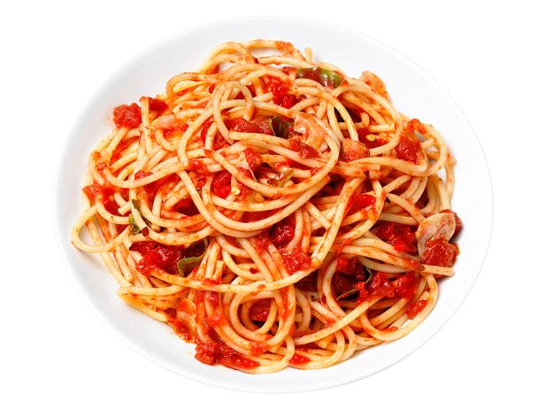
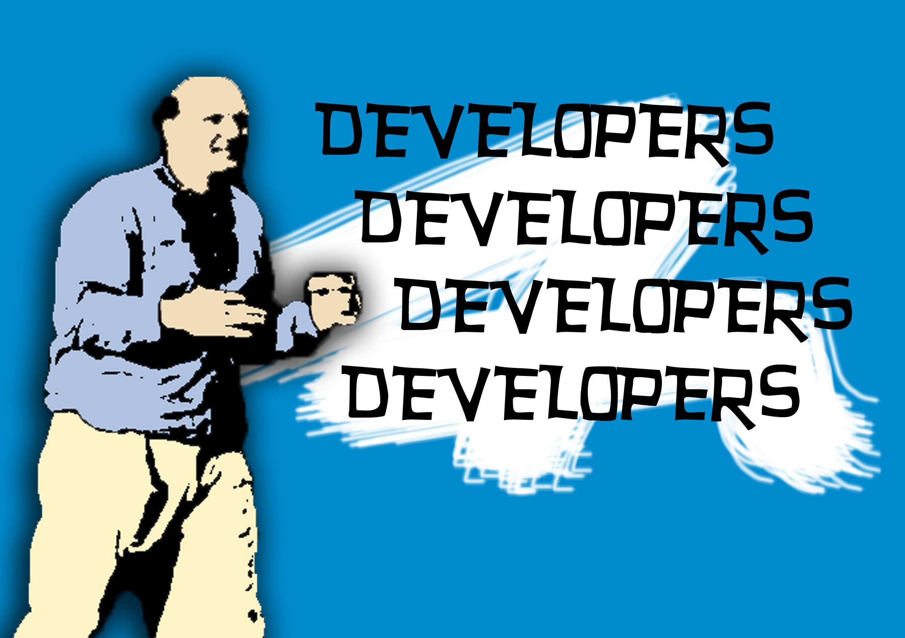

autoscale: true

# [fit] Building Apps and Teams for the Enterprise

#### Android Listener - April 20, 2016

---

# [fit] The Play store gold rush is over...

---

# [fit] ...but these people still need apps...

---

# [fit] ...which means these "people" need...

---

---

# [fit] What are the differences?

--- 

--- 

# _Legacy_

# [fit] Code

--- 

# _Legacy_

# [fit] Systems

---

# [fit] **Considerations**

---

# [fit] Works on my device

---

# [fit] Security

---

# [fit] Distribution

---

# [fit] Maintenance

---

# [fit] Quality

---

# [fit] Scope 
# [fit] Time
# [fit] Cost

--- 

---

# [fit] **_Mindset_**

---

# [fit] Not always about the benjamins[^*]

[^*]: Well, it is always about the benjamins but not directly

---

# Solves a **need**

---

# Makes "things" **more efficient**

---

# One thing that doesn't _have_ to differ.

---

---

# [fit] Depends on 
# [fit] **_People_**

---

# [fit] Depends on 
# [fit] **_Process_**

---

# [fit] **_People_**

---

--- 

--- 

# [fit] **_Common Traits_**

---

# [fit] Savvy

---

# [fit] Active Learners

---

# [fit] **_Healthy Teams_**

---

# [fit] On Boarding

---

# [fit] Skill Development

---

# [fit] Focus

---

# [fit] **_Process_**

---

---

---

# [fit] 3 Types of App

---

# I'm 
# [fit] **Local**

---
# I'm 
# [fit] **Bored**

---

# I'm 
# micro-
# [fit] **tasking**

---

# [fit] App Definition

--- 

# [fit] **Could** Do
# [fit] **Want** To
# [fit] **Has** To

---

# [fit] You simply cannot have a
# [fit] **_hot dog stand_**  without any **_hot dogs_**.

--- 

---

# [fit] assumptions
# [fit] estimates
# [fit] design iteration

--- 

# [fit] Sprint 0

---

--- 

---

## *Kevin McMahon*
### @klmcmahon
### http://about.me/kevinmcmahon

